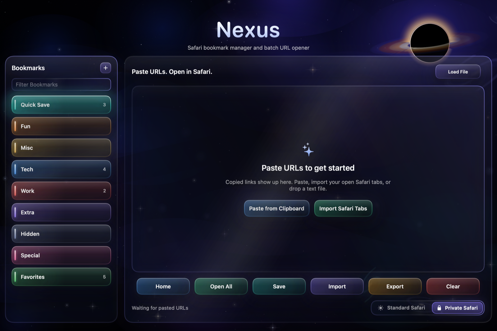

# Nexus

[](https://github.com/RazorBackRoar/Nexus/releases/latest)
[](https://github.com/RazorBackRoar/Nexus/releases/tag/v3.0.0)
[](https://github.com/RazorBackRoar/Nexus/actions/workflows/ci.yml)
[](LICENSE)
[](https://swift.org/)
[](https://developer.apple.com/swiftui/)
[](https://support.apple.com/en-us/HT211814)

<!-- Workspace Health Layer -->


**Native macOS Safari bookmark manager and batch URL opener.**

Swift 6 and SwiftUI. Deep purple glass, a star field, and colored controls. Opens links in Private Safari.

<p align="center">
  <a href="https://github.com/RazorBackRoar/Nexus/releases/latest/download/Nexus.dmg"><strong>↓ Download Nexus.dmg</strong></a>
  ·
  <a href="https://github.com/RazorBackRoar/Nexus/releases">All releases</a>
</p>



## Features

- **Private Safari** — launches in Private Browsing and pauses between tabs
- **Quick Save** — dated URL cards with notes (⌘⇧S)
- **Bookmark folders** — colored glass rows you can filter and reorder
- **Copy Rich Links** — Apple Notes–friendly HTML on the clipboard
- **Paste and drop** — links from the clipboard, or `.txt` / `.csv` / `.md` files
- **Apple Silicon** — Swift 6, arm64 only

---

## Install

1. Download [`Nexus.dmg`](https://github.com/RazorBackRoar/Nexus/releases/latest/download/Nexus.dmg)
2. Open the DMG and drag `Nexus.app` to `/Applications`
3. First launch — right-click the app → **Open** to bypass Gatekeeper on the ad-hoc signed build
4. Go to **System Settings → Privacy & Security → Automation** and enable **Safari** for Nexus

---

## Usage

1. **Add Bookmarks** — click `+`, paste URLs, or drop a text file onto the URL table
2. **Quick Save** — press ⌘⇧S to capture the current links with a timestamp
3. **Organize** — create folders, save groups, and drag to rearrange
4. **Batch Open** — select bookmarks → **Open in Safari**
5. **Rich Links** — copy formatted links for Apple Notes

Data files live under `~/Library/Application Support/Nexus/`:
`bookmarks_v2.json` and `bookmark_groups.json`.

---

## Development

### Requirements

- Swift 6
- macOS 14 or newer
- Apple Silicon

### Setup

```bash
git clone https://github.com/RazorBackRoar/Nexus.git
cd Nexus
swift test
swift run
```

### Build

```bash
./scripts/build-mac.sh
# Output: build/Release/Nexus.dmg
```

### Test

```bash
swift test
```

---

## Community & docs

- [docs/ARCHITECTURE.md](docs/ARCHITECTURE.md) — persistence model, modules, testing
- [BUILD_AND_RELEASE.md](BUILD_AND_RELEASE.md) — prerequisites, build, packaging, release, versioning
- [CONTRIBUTING.md](CONTRIBUTING.md) — how to contribute
- [SECURITY.md](SECURITY.md) — vulnerability reporting
- [CODE_OF_CONDUCT.md](CODE_OF_CONDUCT.md) — community standards

## License

MIT License — see [LICENSE](LICENSE) for details.
Copyright © 2026 RazorBackRoar

<!-- razorcore:runtime:start -->
## Runtime Requirements

For users:
- Download the macOS DMG. Nexus is a native Swift app.

For developers:
- Swift 6, SwiftUI, Apple Silicon.
- Test: `swift test`
- Run: `swift run`
- Package: `./scripts/build-mac.sh`
<!-- razorcore:runtime:end -->
